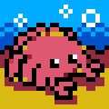

# What framework to use for X?

##  [Invitation link to the ***Game Development in Rust*** Discord server](https://discord.gg/yNtPTb2)

This curated list is from the **Game Development in Rust** Discord server and prioritizes frameworks that have examples and are ready or almost ready for production. This list was made so it can be shared with beginners.

For a longer list of frameworks, see [Are We Game Yet?](https://arewegameyet.rs).

## Resources to understand ECS (Entity Compoent System) and DOD (Data-Oriented Design)

- [Understanding data-oriented design for entity component systems - Unity at GDC 2019](https://www.youtube.com/watch?v=0_Byw9UMn9g).
- [CppCon 2018: Stoyan Nikolov “OOP Is Dead, Long Live Data-oriented Design”](https://www.youtube.com/watch?v=yy8jQgmhbAU) - Harsh title (ECS/DOD is not a silver bullet for every problem), but useful regardless.
- [RustConf 2018 - Closing Keynote - Using Rust For Game Development by Catherine West](https://www.youtube.com/watch?v=aKLntZcp27M) - A classic presentation already - Catherine West gives several examples, explain the problems with them, and shows the alternatives.
- [Data-Oriented Design by Richard Fabian](https://dataorienteddesign.com/dodbook).

## Productivity tools for game development

- [Blender](https://www.blender.org) for 3D modeling.
- [Krita](https://krita.org/en) for 2D image creation.

## High-level frameworks for game development

- [amethyst](https://docs.rs/amethyst) 2D, 3D. Graphics, audio.
- [bevy engine](https://bevyengine.org) 2D, 3D. Graphics, audio, UI. ECS/DOD oriented.
- [oxygengine](https://docs.rs/oxygengine) 2D. Graphics, audio.
- [macroquad](https://docs.rs/macroquad) 2D, 3D. Graphics. Inspired on Raylib (C framework).
- [ggez](https://docs.rs/ggez) 2D. Graphics, audio. Inspired on LÖVE (Lua framework).
- [quicksilver](https://docs.rs/quicksilver) 2D. Graphics, audio.
- [tetra](https://docs.rs/tetra) 2D. Graphics, audio.
- [coffee](https://docs.rs/coffee) 2D. Graphics.

## Just graphics

- [luminance](https://docs.rs/luminance) High level. Uses OpenGL.
- [miniquad](https://docs.rs/miniquad) High-level. Focus on portability. Uses OpenGL and Metal (Work-in-progress).
- [wgpu](https://docs.rs/wgpu) Intermediate-level. Uses `gfx-hal`.
- [glium](https://docs.rs/glium) Intermediate-level. Safer wrapper for OpenGL 3+.
- [golem](https://docs.rs/golem) Intermediate-level. Higher level wrapper built on glow.
- [vulkano](https://docs.rs/vulkano) Intermediate-level. Safer wrapper for Vulkan.
- [rendy](https://docs.rs/rendy) Intermediate-level. Uses `gfx-hal`. Used by `amethyst`.
- [gfx-hal](https://docs.rs/gfx-hal) Low-level, based on Vulkan. Backends: Vulkan, GL, DX12, and Metal.
- [glow](https://docs.rs/glow) Low-level. Safer wrapper for OpenGL and WebGL.
- [erupt](https://docs.rs/erupt) Low-level bindings to Vulkan.
- [ash](https://docs.rs/ash) Low-level bindings to Vulkan. Used by `gfx-hal`.
- [gl46](https://docs.rs/gl46) Low-level. Wrapper for OpenGL 4.6 (generated by Phosphorus). Used by `glow`.
- [gl33](https://docs.rs/gl33) Low-level. Wrapper for OpenGL 3.3 (generated by Phosphorus).

## Window creation and OS integration

- [winit](https://docs.rs/winit) Rusty windowing framework.
- [glfw](https://docs.rs/glfw) Rust wrapper for the C GLFW3 library.
- [fermium](https://docs.rs/fermium) Rust wrapper for the C SDL2 library. Contains more than window creation features.
- [sdl2](https://docs.rs/sdl2) Rust wrapper for the C SDL2 library. Contains more than window creation features.

## Frameworks for ECS

- [hecs](https://docs.rs/hecs) Minimalist, ergonomic API without performance compromises.
- [legion](https://docs.rs/legion)
- [shipyard](https://docs.rs/shipyard)
- [specs](https://docs.rs/specs)

## Frameworks for linear math (for 2D and 3D programming) and physics

- [cgmath](https://docs.rs/cgmath)
- [glam](https://docs.rs/glam)
- [nalgebra](https://docs.rs/nalgebra)
- [nphysics2d](https://docs.rs/nphysics2d) / [nphysics3d](https://docs.rs/nphysics3d)
- [ultraviolet](https://docs.rs/ultraviolet)
- [vek](https://docs.rs/vek)

## Font (parser and/or rasterizer)

- [fontdue](https://docs.rs/fontdue) Pure Rust. No `std` dependency.

## Space partitioning 

- [rstar](https://docs.rs/crate/rstar/) n-dimensional [r*-tree](https://en.wikipedia.org/wiki/R*_tree) implementation
- [bvh](https://docs.rs/crate/bvh/) Bounding Volume Hierarchy, built on top of [nalgebra](https://www.nalgebra.org/).
- [kdtree](https://docs.rs/crate/kdtree/) K-dimensional tree in Rust for fast geospatial indexing and nearest neighbors lookup.
- **ncollide** has its own Bounding Volume Tree implementation: [3d docs](https://www.ncollide.org/rustdoc/ncollide3d/partitioning/struct.BVT.html) and [2d docs](https://www.ncollide.org/rustdoc/ncollide2d/partitioning/struct.BVT.html).
- [spade](https://docs.rs/crate/spade/) Implements  [r*-tree](https://en.wikipedia.org/wiki/R*_tree) and [delaunay triangulation](https://en.wikipedia.org/wiki/Delaunay_triangulation).
- [flat_spatial](https://docs.rs/crate/flat_spatial/) Simple flat structures such as a grid/hashmap of cells.
- [acacia](https://docs.rs/crate/acacia/)  Generic over the dimension of the partitioned space and thus supports binary trees, quadtrees, octrees, etc.

## Audio

- [alto](https://docs.rs/alto) Wrapper for OpenAL. Hardly any further development expected, as OpenAL is a well established library.
- [openal](https://docs.rs/openal) Wrapper for OpenAL. Hardly any further development expected, as OpenAL is a well established library.
- [rodio](https://docs.rs/rodio)
